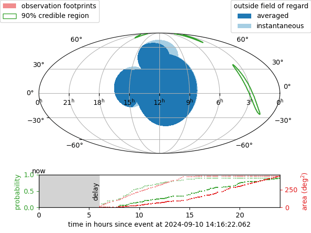

###################################################################
|M4OPT|: Multi-Mission Multi-Messenger Observation Planning Toolkit
###################################################################

   Visualization of an example observing plan generated by |M4OPT| for the `UVEX <https://www.uvex.caltech.edu>`_ mission.

|M4OPT| is an open-source toolkit for multi-facility scheduling of astrophysics
observing campaigns. It focuses on extremely rapid follow-up of gravitational
wave (GW) and neutrino events with heterogeneous networks of space and
ground-based observatories.

|M4OPT| uses the versatile mathematical framework of `mixed integer
programming`__ to model and solve complex observation scheduling problems.
Although |M4OPT| is open source, for the largest problems it can leverage two
industrial-strength commercial MIP solvers: `CPLEX`__ or `Gurobi`__. Both
solvers are available for free for academic users.

__ https://en.wikipedia.org/wiki/Integer_programming
__ https://www.ibm.com/products/ilog-cplex-optimization-studio
__ https://www.gurobi.com

|M4OPT| is designed from the `Astropy affiliated package`__ template, and is
meant to follow those standards, including interoperability with the
`Astropy`__ ecosystem. It also complies with `NASA Procedural Requirements
(NPR) 7150`__ for `Class C software`__ and is suitable for non-safety-critical
ground software applications for `Class D NASA payloads`__.

__ https://www.astropy.org/affiliated/
__ https://www.astropy.org
__ https://nodis3.gsfc.nasa.gov/displayDir.cfm?t=NPR&c=7150&s=2C
__ https://nodis3.gsfc.nasa.gov/displayDir.cfm?Internal_ID=N_PR_7150_002C_&page_name=AppendixD
__ https://nodis3.gsfc.nasa.gov/displayDir.cfm?t=NPR&c=8705&s=4A

***********
How to Cite
***********

If you use |M4OPT| in your research, then please cite the following paper:

   Singer, L. P., Criswell, A. W., Leggio, S. C., et al. (2025). Optimal Follow-Up of Gravitational-Wave Events with the UltraViolet EXplorer (UVEX) (Version 1). https://doi.org/10.48550/ARXIV.2502.17560

*****************
Table of Contents
*****************

.. toctree::
   :maxdepth: 2

   install/index
   guide/index
   design/index
   dev/index

*****
Index
*****

* :ref:`genindex`
* :ref:`modindex`
* :ref:`search`
